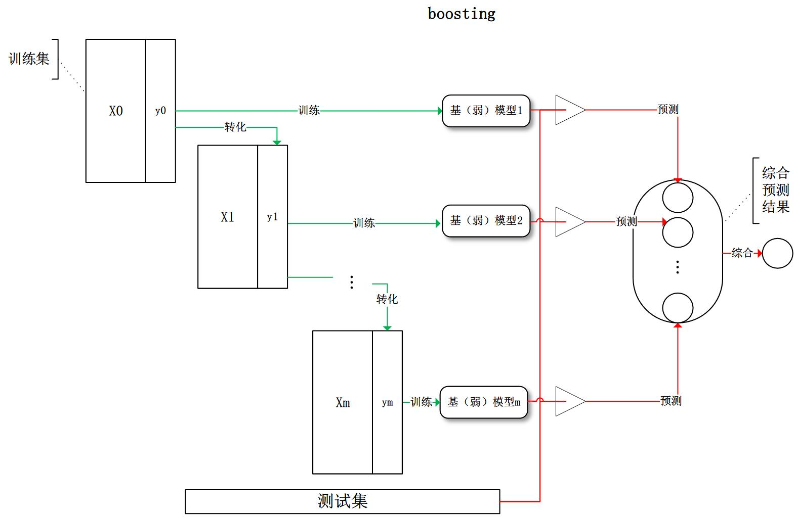

# 集成学习是什么？
简单来说，集成学习是一种技术框架，其按照不同的思路来组合基础模型，从而达到其利断金的目的。
目前，有三种常见的集成学习框架：bagging，boosting和stacking。国内，南京大学的周志华教授对集成学习有很深入的研究，其在09年发表的一篇概述性论文《Ensemble Learning》对这三种集成学习框架有了明确的定义，概括如下：
- bagging：从训练集从进行子抽样组成每个基模型所需要的子训练集，对所有基模型预测的结果进行综合产生最终的预测结果：

- boosting：训练过程为阶梯状，基模型按次序一一进行训练（实现上可以做到并行），基模型的训练集按照某种策略每次都进行一定的转化。对所有基模型预测的结果进行线性综合产生最终的预测结果：

- stacking：将训练好的所有基模型对训练基进行预测，第j个基模型对第i个训练样本的预测值将作为新的训练集中第i个样本的第j个特征值，最后基于新的训练集进行训练。同理，预测的过程也要先经过所有基模型的预测形成新的测试集，最后再对测试集进行预测:

今天主要内容集中于bagging和boosting

 
# 偏差和方差
广义的偏差（bias）描述的是预测值和真实值之间的差异，方差（variance）描述距的是预测值作为随机变量的离散程度。《Understanding the Bias-Variance Tradeoff》当中有一副图形象地向我们展示了偏差和方差的关系：

## 模型的偏差和方差是什么？
模型的偏差是一个相对来说简单的概念：训练出来的模型在训练集上的准确度。

要解释模型的方差，首先需要重新审视模型：模型是随机变量。设样本容量为n的训练集为随机变量的集合$x_1,x_2,\cdots,x_n$，那么模型是以这些随机变量为输入的随机变量函数。抽样的随机性带来了模型的随机性。

定义随机变量的值的差异是计算方差的前提条件，通常来说，我们遇到的都是数值型的随机变量，数值之间的差异再明显不过（减法运算）。但是，模型的差异性呢？我们可以理解模型的差异性为模型的结构差异，例如：线性模型中权值向量的差异，树模型中树的结构差异等。在研究模型方差的问题上，我们并不需要对方差进行定量计算，只需要知道其概念即可。

研究模型的方差有什么现实的意义呢？我们认为方差越大的模型越容易过拟合：假设有两个训练集A和B，经过A训练的模型Fa与经过B训练的模型Fb差异很大，这意味着Fa在类A的样本集合上有更好的性能，而Fb反之，这便是我们所说的过拟合现象。

我们常说集成学习框架中的基模型是弱模型，通常来说弱模型是偏差高（在训练集上准确度低）方差小（防止过拟合能力强）的模型。但是，并不是所有集成学习框架中的基模型都是弱模型。bagging和stacking中的基模型为强模型（偏差低方差高），boosting中的基模型为弱模型。

在bagging和boosting框架中，通过计算基模型的期望和方差，我们可以得到模型整体的期望和方差。为了简化模型，我们假设基模型的权重、方差及两两间的相关系数相等。由于bagging和boosting的基模型都是线性组成的，那么有：

假设m个模型对某个变量$x$预测结果分别为$f_1,\cdots,f_m$，最终预测结果是多个模型加权平均$f=\sum_i^m \gamma_i f_i$。假设每个个模型的均值和方差是相等的$\mu, \sigma^2$。

$$
\mathbb{E}(f)=\sum_i^m \gamma_i \mathbb{E}(f_i)=\sum_i \gamma_i \mu
$$

$$
Var(f)=Cov(\sum_i \gamma_i f_i, \sum_j \gamma_j f_j)\\=m^2\gamma^2\sigma^2\rho + m\gamma^2\sigma^2(1-\rho)
$$

这里$\rho$代表相关系数
 
## bagging的偏差和方差
对于bagging来说，每个基模型的权重等于1/m且期望近似相等（子训练集都是从原训练集中进行子抽样），故我们可以进一步化简得到：
$$
\mathbb{E}(f)=\mu\\
Var(f)=\sigma^2 \rho + \frac{\sigma^2(1-\rho)}{m}
$$

根据上式我们可以看到，整体模型的期望近似于基模型的期望，这也就意味着整体模型的偏差和基模型的偏差近似。同时，整体模型的方差小于等于基模型的方差（当相关性为1时取等号），随着基模型数（m）的增多，整体模型的方差减少，从而防止过拟合的能力增强，模型的准确度得到提高。但是，模型的准确度一定会无限逼近于1吗？并不一定，当基模型数增加到一定程度时，方差公式第二项的改变对整体方差的作用很小，防止过拟合的能力达到极限，这便是准确度的极限了。另外，在此我们还知道了为什么bagging中的基模型一定要为强模型，否则就会导致整体模型的偏差度低，即准确度低。

Random Forest是典型的基于bagging框架的模型，其在bagging的基础上，进一步降低了模型的方差。Random Fores中基模型是树模型，在树的内部节点分裂过程中，不再是将所有特征，而是随机抽样一部分特征纳入分裂的候选项。这样一来，基模型之间的相关性降低，从而在方差公式中，第一项显著减少，第二项稍微增加，整体方差仍是减少。

## boosting的偏差和方差
　　对于boosting来说，基模型的训练集抽样是强相关的，那么模型的相关系数近似等于1，故我们也可以针对boosting化简公式为
$$
E(f)=\sum_i \gamma_i \mu_i\\
Var(f)=m^2 \gamma^2 \sigma^2
$$

　　通过观察整体方差的表达式，我们容易发现，若基模型不是弱模型，其方差相对较大，这将导致整体模型的方差很大，即无法达到防止过拟合的效果。因此，boosting框架中的基模型必须为弱模型。

　　因为基模型为弱模型，导致了每个基模型的准确度都不是很高（因为其在训练集上的准确度不高）。随着基模型数的增多，整体模型的期望值增加，更接近真实值，因此，整体模型的准确度提高。但是准确度一定会无限逼近于1吗？仍然并不一定，因为训练过程中准确度的提高的主要功臣是整体模型在训练集上的准确度提高，而随着训练的进行，整体模型的方差变大，导致防止过拟合的能力变弱，最终导致了准确度反而有所下降。

　　基于boosting框架的Gradient Tree Boosting模型中基模型也为树模型，同Random Forrest，我们也可以对特征进行随机抽样来使基模型间的相关性降低，从而达到减少方差的效果。

## 模型的独立性
如何衡量基模型的独立性？我们说过，抽样的随机性决定了模型的随机性，如果两个模型的训练集抽样过程不独立，则两个模型则不独立。这时便有一个天大的陷阱在等着我们：bagging中基模型的训练样本都是独立的随机抽样，但是基模型却不独立呢？

　　我们讨论模型的随机性时，抽样是针对于样本的整体。而bagging中的抽样是针对于训练集（整体的子集），所以并不能称其为对整体的独立随机抽样。那么到底bagging中基模型的相关性体现在哪呢？在知乎问答《为什么说bagging是减少variance，而boosting是减少bias?》中请教用户“过拟合”后，我总结bagging的抽样为两个过程：

样本抽样：整体模型F(X1, X2, ..., Xn)中各输入随机变量（X1, X2, ..., Xn）对样本的抽样
子抽样：从整体模型F(X1, X2, ..., Xn)中随机抽取若干输入随机变量成为基模型的输入随机变量
　　假若在子抽样的过程中，两个基模型抽取的输入随机变量有一定的重合，那么这两个基模型对整体样本的抽样将不再独立，这时基模型之间便具有了相关性。

## 小结
　　还记得调参的目标吗：模型在训练集上的准确度和防止过拟合能力的大和谐！为此，我们目前做了一些什么工作呢？

使用模型的偏差和方差来描述其在训练集上的准确度和防止过拟合的能力
对于bagging来说，整体模型的偏差和基模型近似，随着训练的进行，整体模型的方差降低
对于boosting来说，整体模型的初始偏差较高，方差较低，随着训练的进行，整体模型的偏差降低（虽然也不幸地伴随着方差增高），当训练过度时，因方差增高，整体模型的准确度反而降低
整体模型的偏差和方差与基模型的偏差和方差息息相关
　　这下总算有点开朗了，那些让我们抓狂的参数，现在可以粗略地分为两类了：控制整体训练过程的参数和基模型的参数，这两类参数都在影响着模型在训练集上的准确度以及防止过拟合的能力。

> 节选自博文：
> http://www.cnblogs.com/jasonfreak/p/5657196.html

> 更多实例请参考
> http://scikit-learn.org/stable/modules/ensemble.html
 
