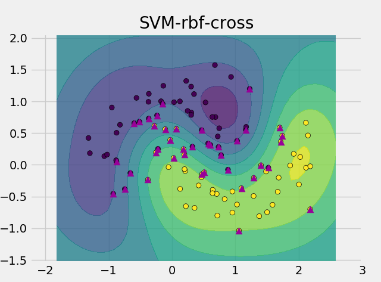

# 特征工程扩展
截至目前为止，我们都都没有建立从类似的分类图形：

到具体的应用场景的映射。这是因为在遇到具体的问题时候首先需要遇到的问题就是数据建模。

从直观上来看，我们目前所熟悉的内容都是向量化的知识，但是对于文本问题，并没有一个比较明确的向量化，因此在进行分类过程中，如何将文本内容转行为向量内容是首先要接触的。

**这个过程也是从模型算法到实际内容的桥梁**

# 单词向量化
**单词向量化常用语神经网络进行语义分析的过程**
在NLP中，传统方法通常是把词转换为离散的不可分割的符号，这导致很难利用不同的词之间的关系（所有的单词之间的距离都一样），例如dog：id143，cat：id537，这使得我们需要更多的数据来训练模型，而使用向量的表达的话可以克服这一缺点，例如在向量中可以利用cat和dog之间的相似性。使用向量表示词也叫word embedding
当然单词向量化也有onehot方法，但是这种方法与离散分割的形式是一样的。

# 文本向量化
**文本向量化与单词向量化不同，其常用于简单的机器学习算法用于分析文本相似度**
## one-hot表示法
one-hot表示法先将文本数据集中不重复的单词提取出来，得到一个大小为V的词汇表。然后用一个V维的向量来表示一个文章，向量中的第d个维度上的1表示词汇表中的第d个单词出现在这篇文章中。比如给定一个数据集 

## tf表示法
不同于one-hot表示法只关心单词是否出现，tf (term-frequency)表示法还关心单词出现的次数，因此tf矩阵中每个元素表示其对应的单词在文章中出现的次数/文章中的总次数，即单词在文章中的频率。

## tf-idf 表示法
tf-idf (term frequency–inverse document frequency)，不仅考虑了单词在文章中的出现次数，还考虑了其在整个文本数据集中的出现次数。TF-IDF的主要思想是：如果某个词或短语在一篇文章中出现的频率TF高，并且在其他文章中很少出现，则认为此词或者短语具有很好的类别区分能力。

