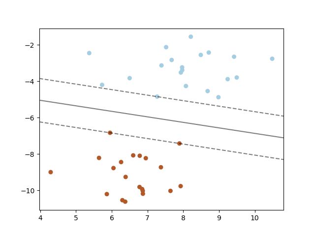

# 支持向量基思路与神经网络大相径庭
相比较而言SVM植根于凸优化理论，具有良好的最优化性，而对于神经网络而言并非是一个严谨的凸优化过程。
但是相比较而言SVM在算法上理解起来比神经网络更加难以理解，这其中设计**拉格朗日函数、对偶问题**，可能更加难以理解的问题是**内积核**，这个是由前面两个概念所推演而出的。所以这里推荐一本介绍比较详细的书《神经网络与机器学习》第六章。

# 最优化问题
$$
J(w, b, a)=\frac 1 2 w^t w-\sum_i^N \alpha_i [d_i (w^T x_i +b)-1]
$$
其中$d_i$是分类标签(-1, 1), $\alpha_i$为拉格朗日乘子，这是一个稀疏的，只有支持向量不为0。两个分类目的在于两个分类边缘最大化。
对偶问题为, 最大化目标函数

$$
Q(\alpha)=\sum_i^N \alpha_i - \frac 1 2 \sum_i^N \sum_i^N \alpha_i \alpha_j d_i d_j k(x_i, x_j)
$$
这个k就称为内积核。

**可能我们最熟悉的一张图是这个**

上面虚线所经过的点就是支持向量，其是对于最大化对偶函数求解过程中，alpha不为0的就为支持向量。具体公式推演请参阅《神经网络与机器学习》第六章。

# 所以说图形对于我们理解问题没有任何帮助，反而会限制我们的思维

# 由此可以看到SVM实际于更接近与曲线拟合问题，这种分类的复杂性隐藏与核函数之中。而非神经网络所类似将复杂性显式的置于权值之中。因此对于分类问题其效果要比等效单层神经网络的朴素贝叶斯算法更优秀。同时有限项多项式自带抗过拟合效果